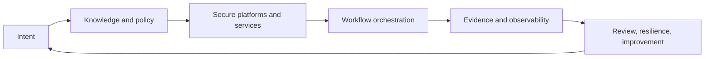

# Nexarion Technologies

**Technology operations that behave like a system, not a pile of emergencies.**

[Nexarion Technologies, LLC](https://www.nexariontechnologies.com/) is a Texas-based technology operations and engineering company focused on practical IT execution, integration, automation, security, observability, and controlled AI augmentation.

We help organizations move from reactive support and scattered tooling toward documented, measurable, and supportable operations.

## What we work on

### Core technology operations

Endpoint and server operations, network and site infrastructure, identity administration, Microsoft 365 and Azure, support processes, monitoring, patch cadence, and living technical documentation.

### Security and continuity

Access control, MFA, endpoint protection coordination, credential and secrets practices, vulnerability follow-up, backup monitoring, restoration planning, and incident-ready operating procedures.

### Integration and automation

REST/JSON APIs, service bridges, n8n orchestration, onboarding and offboarding flows, ticket routing, reporting, reconciliation, alerts, approval gates, and repeatable runbooks.

### Data, observability, and evidence

PostgreSQL and object-storage patterns, logs, metrics, dashboards, health and readiness checks, trace identifiers, evidence records, and operational review loops.

### Practical AI systems

Local-first and provider-abstracted AI patterns, bounded retrieval, MCP/context services, source provenance, deterministic validation, human-in-the-loop controls, and explicit separation between analysis and consequential execution.

## Keystone: the organizational operating model

**Keystone** is Nexarion's operating-model framework for connecting business intent to controlled technical execution.

It is based on a few public principles:

- **Visibility:** know what exists, who owns it, and whether it is healthy.
- **Policy:** turn expectations into documented, reviewable controls and runbooks.
- **Enforcement:** apply identity, access, security, and approval boundaries consistently.
- **Automation:** automate repeatable work without hiding failure or bypassing authority.
- **Audit:** preserve source, trace, decision, and outcome evidence.
- **Resilience:** design for recovery, restoration, and degraded operation.
- **Improvement:** use telemetry and review to improve the system over time.



The practical maturity path is:

```text
Stabilize -> Standardize -> Automate -> Optimize
```

Keystone is an operating theory and delivery framework, not a claim that every internal component is publicly available. Internal specifications, project taxonomy, client adaptations, and private implementation details remain proprietary.

## Public engineering portfolio

These repositories are sanitized demonstrations of selected engineering patterns:

- **[mcp-operations-context-demo](https://github.com/Nexarion-Technologies/mcp-operations-context-demo):** bounded, read-only MCP retrieval with source provenance and conservative publication controls.
- **[n8n-ai-workflow-demo](https://github.com/Nexarion-Technologies/n8n-ai-workflow-demo):** validation-first orchestration with synthetic services, fail-closed branches, and evidence output.
- **[api-bridge-health-demo](https://github.com/Nexarion-Technologies/api-bridge-health-demo):** a production-shaped API bridge with health, readiness, metrics, bounded reads, and automated tests.
- **[ai-prompt-eval-harness](https://github.com/Nexarion-Technologies/ai-prompt-eval-harness):** deterministic evaluation of grounding, abstention, safety boundaries, structured contracts, and regressions.

## Publication boundary

Public repositories use synthetic data and sanitized architecture. They do not contain:

- client data, identities, contracts, or confidential correspondence;
- live credentials, tokens, tenant identifiers, or private endpoints;
- internal network topology, host inventories, or production exports;
- private GitLab history or proprietary implementation details;
- unrestricted execution authority or live consequential actions.

Repository licenses apply only to the contents explicitly published in each repository. They do not grant rights to private systems, client materials, unpublished Keystone specifications, Nexarion branding, or non-public implementation work.

## Collaboration

Nexarion remains owner-led and open to partnerships, project collaborations, contributors, and employment arrangements involving its principal when roles, ownership, and intellectual-property boundaries are explicit.

Public work is maintained by [Rien Regalado](https://github.com/rienregalado), Owner / Principal.

**Website:** [nexariontechnologies.com](https://www.nexariontechnologies.com/)  
**Contact:** [info@nexarion.tech](mailto:info@nexarion.tech)
